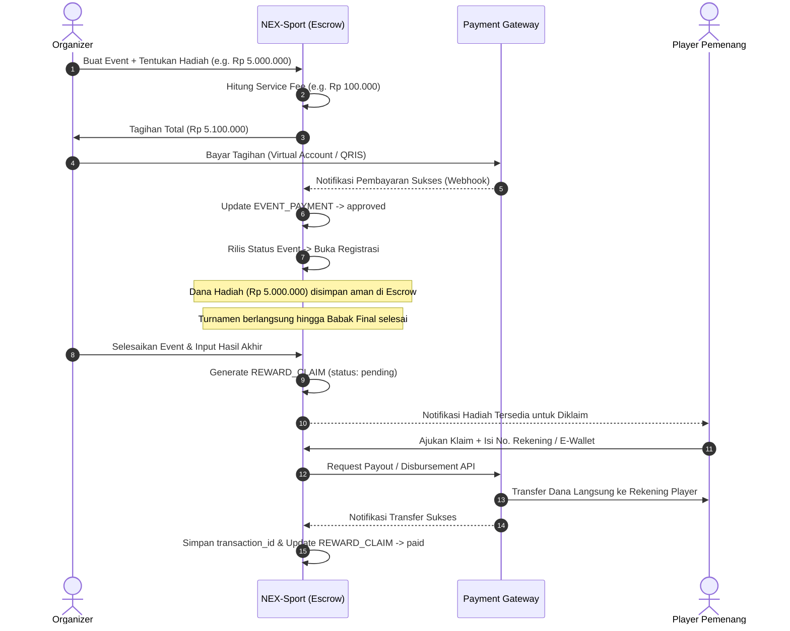

# Arsitektur & Alur Sistem Keuangan (Escrow & Payout)

Sistem keuangan NEX-Sport dirancang menggunakan model **Escrow (Rekening Bersama)** untuk menjamin keamanan hadiah bagi para Player, serta memotong biaya operasional Organizer. 

Seluruh alur pembayaran masuk (*inbound*) dan pembayaran keluar (*outbound*) diproses secara otomatis melalui integrasi Payment Gateway (seperti Midtrans atau Xendit).

---

## 🔄 Alur Keuangan End-to-End

Berikut adalah visualisasi alur perpindahan dana dari Organizer, masuk ke Escrow Platform, hingga disalurkan ke Pemenang secara otomatis:

---

## 📂 Komponen Utama Sistem Keuangan

### 1. Perhitungan Biaya Layanan (`SERVICE_FEE_CONFIG`)
Admin dapat mengonfigurasi biaya layanan secara dinamis berdasarkan nominal total hadiah turnamen.
* *Contoh Konfigurasi:*
  * Total Hadiah Rp 0 - Rp 1.000.000 $\rightarrow$ Biaya Layanan: Rp 50.000
  * Total Hadiah Rp 1.000.001 - Rp 5.000.000 $\rightarrow$ Biaya Layanan: Rp 150.000
  * Total Hadiah $>$ Rp 5.000.000 $\rightarrow$ Biaya Layanan: 3% dari Total Hadiah

### 2. Deposit Awal Organizer (`EVENT_PAYMENT`)
* Untuk menerbitkan event komersial yang memiliki hadiah uang tunai, Organizer **wajib menyetor penuh** nilai hadiah di awal ditambah biaya layanan.
* Hal ini penting untuk mencegah penipuan turnamen (turnamen fiktif di mana hadiah tidak pernah dibayarkan).
* Dana hadiah akan ditampung di akun escrow platform (di kelola oleh Payment Gateway merchant wallet).

### 3. Payout Otomatis (`REWARD_CLAIM`)
* Setelah turnamen dinyatakan selesai oleh Organizer (dan divalidasi oleh hasil bracket), sistem mendeteksi juara 1, 2, 3, dst.
* Player yang menjadi pemenang akan mendapatkan tombol **"Tarik Hadiah"** di dashboard mereka.
* Player memasukkan detail bank tujuan atau e-wallet (GoPay, OVO, Dana, ShopeePay, dll.).
* Sistem mengirimkan perintah transfer instan (*disbursement*) secara *real-time* ke Payment Gateway.
* Bukti transfer digital (`transaction_id` dari bank/gateway) langsung disimpan sebagai bukti pembayaran yang sah.

---

## 🛡️ Keamanan & Penanganan Masalah (Edge Cases)

| Skenario | Solusi Sistem |
|----------|---------------|
| **Turnamen Dibatalkan oleh Organizer** | Dana hadiah di Escrow dikembalikan penuh (*refund*) ke saldo Organizer. Biaya layanan (`service_fee`) tidak dikembalikan/hangus sebagai biaya administrasi. |
| **Terjadi Sengketa Hasil Match** | Jika ada laporan kecurangan, Admin/Super Admin dapat melakukan *freeze* terhadap status klaim hadiah di tabel `REWARD_CLAIM` sebelum payout diproses oleh sistem. |
| **Transfer Gagal (Salah No Rekening)** | Status klaim di-update ke `failed`. Sistem mengirim notifikasi ke Player untuk memperbarui informasi rekening mereka tanpa harus membatalkan status juara. |
