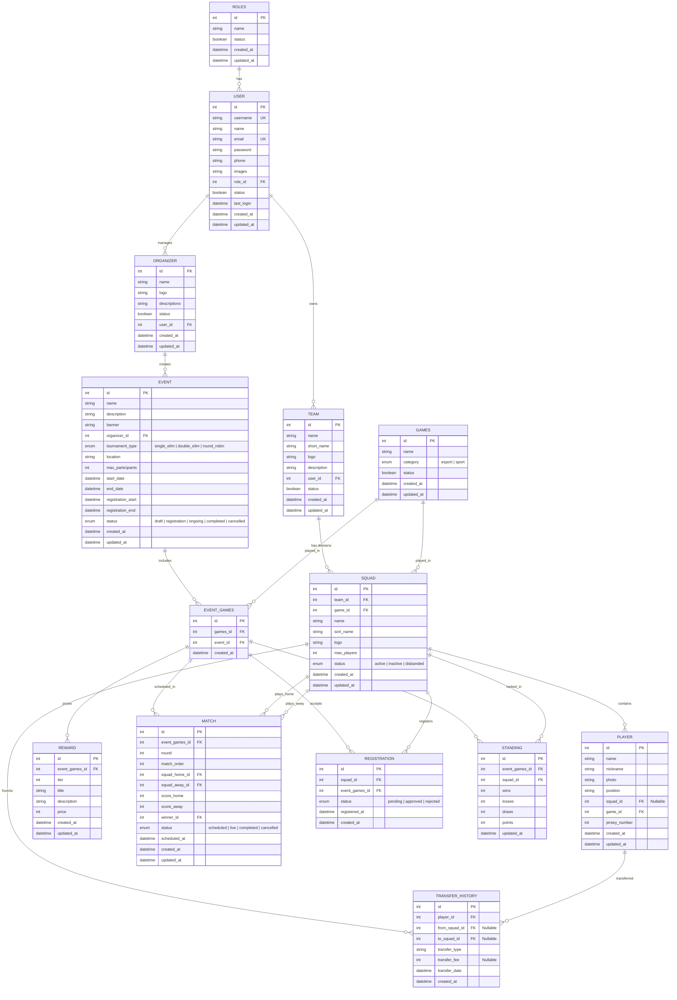

# Analisis & Revisi Rancangan NEX-Sport

Hasil review mendalam terhadap struktur data di [nex-sport.xlsx](file:///d:/webapp/nex-sport/nex-sport.xlsx).

---

## 🔴 Masalah yang Perlu Diperbaiki

### 1. Typo: "orgnaizer" → "organizer"
Muncul di 3 tempat: tabel Roles (baris 4), nama tabel Organizer (baris 20), dan tabel User roles (baris 10).

```diff
- orgnaizer
+ organizer
```

### 2. Duplicate ID di Tabel Games
Game `Football` dan `PUBG Mobile` sama-sama menggunakan **id = 2**. `Football` seharusnya **id = 3**.

| id | name | category | status |
|----|------|----------|--------|
| 1 | Mobile Legends | esport | ✅ |
| 2 | PUBG Mobile | esport | ✅ |
| ~~2~~ → **3** | Football | sport | ✅ |
| ~~3~~ → **4** | Volleyball | sport | ❌ |

### 3. Tabel Event — Kolom Ambigu
Data event terlihat membingungkan:

| No | name | description | banner | organizer_id |
|----|------|-------------|--------|--------------|
| 1 | Tournament 17 Agustus | **Sport** | **Football** | 1 |
| | | **Esport** | **ML** | 1 |

> [!WARNING]
> Kolom `description` diisi "Sport"/"Esport" (seharusnya deskripsi event), dan `banner` diisi "Football"/"ML" (seharusnya path gambar banner). Ini terlihat seperti sub-kategori game, bukan description & banner yang sebenarnya. Relasi game ke event sudah ditangani oleh tabel **Event Games**.

### 4. Tabel Squad — Baris Data Rusak
Baris data contoh memiliki literal text `"id"` di kolom id, bukan angka:

```diff
- id, "req regum qeon", "RRQ", ...
+ 1, "Rex Regum Qeon", "RRQ", ...
```

### 5. Tabel Organizer — `user_id` Kosong
Kolom `user_id` didefinisikan tapi tidak diisi di sample data, padahal ini relasi penting untuk menentukan siapa yang mengelola organizer.

### 6. Tabel Player — Tidak Ada Sample Data
Hanya header tanpa data contoh, sehingga sulit memvalidasi struktur.

### 7. Tabel Roles — Redundan dengan Kolom User
Tabel Roles ada, tapi di tabel User kolom `roles` langsung menyimpan **nama role** (`"super-admin"`) bukan **role_id** (FK). Ini inkonsisten — seharusnya menggunakan foreign key.

```diff
  USER table:
- roles: "super-admin"  (string literal)
+ role_id: 1             (FK → Roles.id)
```

---

## 🟡 Elemen yang Perlu Ditambahkan

### A. Tabel yang Hilang (Kritis)

#### 1. 🏢 `Team` — Organisasi Induk Tim
Menampung divisi-divisi squad di bawah satu bendera organisasi (misalnya RRQ memiliki RRQ Hoshi, RRQ Sena, dll).

| Kolom | Tipe | Keterangan |
|-------|------|------------|
| id | int PK | |
| name | string | Nama tim (e.g., "Rex Regum Qeon") |
| short_name | string | Singkatan (e.g., "RRQ") |
| logo | string | Path file logo |
| description | string | Deskripsi tim |
| user_id | int FK | Pemilik/Manager tim (FK to User) |
| status | boolean | Status aktif tim |

#### 2. 🔄 `TransferHistory` — Bursa & Riwayat Transfer Player
Mencatat setiap perpindahan pemain antar squad untuk mendukung history bursa transfer.

| Kolom | Tipe | Keterangan |
|-------|------|------------|
| id | int PK | |
| player_id | int FK | Pemain yang ditransfer |
| from_squad_id | int FK (null) | Squad asal (null jika sebelumnya free agent) |
| to_squad_id | int FK (null) | Squad tujuan (null jika dilepas jadi free agent) |
| transfer_type | string | Jenis: "join", "transfer", "release", "disband" |
| transfer_fee | int (null) | Biaya transfer jika ada |
| transfer_date | datetime | Tanggal efektif transfer |

#### 3. 🏆 `Match` — Pertandingan
Inti dari tournament management! Tanpa ini, tidak bisa melacak pertandingan.

| Kolom | Tipe | Keterangan |
|-------|------|------------|
| id | int PK | |
| event_games_id | int FK | Game dalam event mana |
| round | int | Ronde ke-berapa |
| match_order | int | Urutan match dalam ronde |
| squad_home_id | int FK | Tim tuan rumah |
| squad_away_id | int FK | Tim tamu |
| score_home | int | Skor tim home |
| score_away | int | Skor tim away |
| winner_id | int FK | Squad pemenang |
| status | enum | `scheduled`, `live`, `completed`, `cancelled` |
| scheduled_at | datetime | Jadwal pertandingan |

#### 4. 📝 `Registration` — Pendaftaran Squad ke Event
Menghubungkan squad dengan event games (many-to-many).

| Kolom | Tipe | Keterangan |
|-------|------|------------|
| id | int PK | |
| squad_id | int FK | Tim yang mendaftar |
| event_games_id | int FK | Game dalam event |
| status | enum | `pending`, `approved`, `rejected` |
| registered_at | datetime | Waktu pendaftaran |

#### 5. 📊 `Standing` — Klasemen (untuk Round Robin)
| Kolom | Tipe | Keterangan |
|-------|------|------------|
| id | int PK | |
| event_games_id | int FK | |
| squad_id | int FK | |
| wins | int | Jumlah menang |
| losses | int | Jumlah kalah |
| draws | int | Jumlah seri |
| points | int | Total poin |

---

### B. Kolom yang Hilang di Tabel Existing

#### 6. 🔐 User — Authentication Fields
```
+ password        (string)  — Hash password
+ email_verified   (boolean) — Status verifikasi email
+ last_login       (datetime)
```

#### 7. 📅 Event — Waktu & Status
```
+ start_date      (datetime) — Tanggal mulai
+ end_date        (datetime) — Tanggal selesai
+ registration_start (datetime) — Buka pendaftaran
+ registration_end   (datetime) — Tutup pendaftaran
+ status          (enum: draft, registration, ongoing, completed, cancelled)
+ location        (string)   — Lokasi event (untuk sport)
+ max_participants (int)     — Batas peserta
+ tournament_type  (enum: single_elimination, double_elimination, round_robin, swiss)
```

#### 8. 🏅 Reward — Deskripsi
```
+ title           (string)  — "Juara 1", "Juara 2", "MVP"
+ description     (string)  — Detail hadiah
```

#### 9. 👥 Squad — Menghubungkan ke Team & Game
```
+ team_id         (int FK)  — Menghubungkan squad dengan Team induk
+ game_id         (int FK)  — Menghubungkan dengan Game spesifik (e.g., MLBB)
+ max_players     (int)     — Batas anggota (5 untuk ML, 11 untuk Football)
+ status          (enum: active, inactive, disbanded)
```

#### 10. 🎮 Player — Pembatasan 1 Squad & Detail
```
+ squad_id        (int FK, null) — Foreign Key ke Squad (nullable jika free agent). 1 Player hanya bisa di 1 Squad pada satu waktu.
+ game_id         (int FK)  — Game utama yang dimainkan
+ position        (string)  — Posisi (Gold Laner, Striker, dsb)
+ jersey_number   (int)     — Nomor punggung (sport)
```

#### 11. ⏱️ Semua Tabel — Timestamps
```
+ created_at      (datetime)
+ updated_at      (datetime)
```

---

### C. Fitur Tambahan yang Disarankan

| # | Fitur | Keterangan |
|---|-------|------------|
| 12 | **Bracket Generator** | Auto-generate bracket dari peserta terdaftar |
| 13 | **Bursa Transfer UI** | Halaman khusus melihat riwayat perpindahan player dan form transfer pemain |
| 14 | **Notification/Log** | Tabel activity log untuk tracking perubahan |
| 15 | **Media/Gallery** | Upload foto/dokumentasi event |

---

## Revisi ERD Lengkap



---

## Ringkasan

| Kategori | Jumlah |
|----------|--------|
| 🔴 Bug / Error data | **7** masalah |
| 🟡 Tabel baru yang kritis | **3** tabel (Match, Registration, Standing) |
| 🟡 Kolom baru yang penting | **~15** kolom tersebar di 6 tabel |
| 🟢 Fitur tambahan (opsional) | **3** fitur |

> [!IMPORTANT]
> **Rekomendasi**: Setujui revisi ini sebagai blueprint final, lalu saya akan langsung mulai membangun aplikasinya dengan struktur database yang sudah diperbaiki. Apakah ada yang ingin ditambah/ubah lagi?
