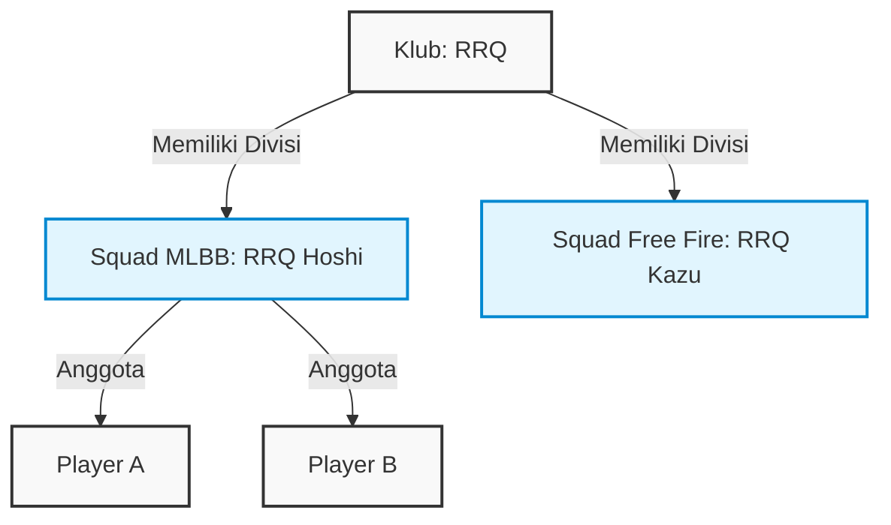
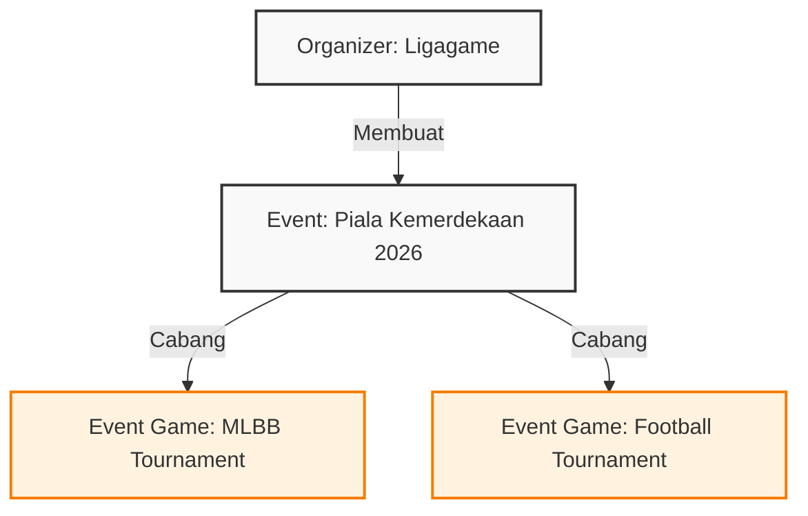

# Kamus Istilah (Glossary) & Hubungan Entitas Per Role

Untuk memudahkan Anda dalam memberikan instruksi dan menghindari kebingungan antara istilah **Organizer**, **Team**, **Squad**, dan **Player**, berikut adalah panduan penyebutan entitas dan perannya dalam aplikasi NEX-Sport.

---

## 🗺️ Peta Istilah Cepat (Siapa & Apa?)

| Peran (Role) | Istilah Bahasa Indonesia | Nama Tabel Utama | Penjelasan Sederhana |
|---|---|---|---|
| 🔴 **Super Admin** | Admin Platform / Pemilik | `users` (role_id: admin) | Pemilik aplikasi NEX-Sport yang mengatur biaya dan verifikasi. |
| 🟠 **Admin** | Admin Operasional | `users` (role_id: staff) | Staf yang membantu mengelola data game dan operasional harian. |
| 🟡 **Organizer** | Penyelenggara / Panitia | `organizers`, `events` | Pihak ketiga yang membuat & menyelenggarakan turnamen. |
| 🟢 **Player (User)**| Pemain / Atlet | `players` | Individu yang mendaftar dan bermain di turnamen. |
| 🟢 **Team** | Klub / Organisasi Induk | `teams` | Organisasi e-sport/sports (contoh: *RRQ*, *EVOS*, *Persija*). |
| 🟢 **Squad** | Tim Game / Divisi | `squads` | Tim spesifik di bawah klub untuk game tertentu yang **berlaga di turnamen** (contoh: *RRQ Hoshi* khusus MLBB). |

---

## 👥 1. Kelompok Tim: Perbedaan "Team" vs "Squad" vs "Player"

Ini bagian yang paling sering membuat bingung. Hubungannya adalah **One-to-Many**:
* Satu **Team (Klub)** memiliki banyak **Squad (Tim Game)**.
* Satu **Squad (Tim Game)** memiliki banyak **Player (Pemain)**.

### Panduan Instruksi:
* Gunakan istilah **"Team"** jika merujuk pada **Klub Induk** secara keseluruhan.
* Gunakan istilah **"Squad"** jika merujuk pada **Pihak yang mendaftar turnamen** (karena turnamen dibatasi per game).
* Gunakan istilah **"Player"** jika merujuk pada **Pemain Individu**.

---

## 🏢 2. Kelompok Penyelenggara: Perbedaan "Organizer" vs "Event" vs "Event Game"

Hubungan antara penyelenggara dan kegiatannya adalah:
* Satu **Organizer** membuat banyak **Event**.
* Satu **Event** dapat mempertandingkan banyak **Event Game (Turnamen)**.

### Panduan Instruksi:
* Gunakan istilah **"Organizer"** jika merujuk pada **Pihak Penyelenggaranya** (yang punya logo dan profil).
* Gunakan istilah **"Event"** jika merujuk pada **Nama Kegiatannya** secara umum (contoh: "Liga Mahasiswa").
* Gunakan istilah **"Event Game"** jika merujuk pada **Spesifik Turnamen Game** di dalam event tersebut (yang memiliki harga tiket pendaftaran, kuota tim, dan bracket sendiri).

---

## 💸 3. Kelompok Keuangan: Perbedaan "Payment" vs "Claim"

* **`event_payments` (Deposit Penerbitan Event):** Uang mengalir **dari Organizer $\rightarrow$ Platform**. Ini adalah jaminan deposit hadiah yang disetorkan organizer sebelum turnamen dimulai.
* **`registrations` (Pembayaran Tiket):** Uang mengalir **dari Squad $\rightarrow$ Platform (Escrow)**. Ini adalah tiket pendaftaran turnamen yang dibayar oleh tim peserta.
* **`reward_claims` (Pencairan Hadiah/Withdraw):** Uang mengalir **dari Platform (Escrow) $\rightarrow$ Player Pemenang**. Ini adalah hadiah yang ditarik secara otomatis oleh pemenang setelah turnamen selesai.
* **`payouts/refunds`:** Uang dikembalikan dari platform ke Squad (jika pendaftaran ditolak) atau sisa uang tiket dilepas ke Organizer (setelah turnamen selesai).
