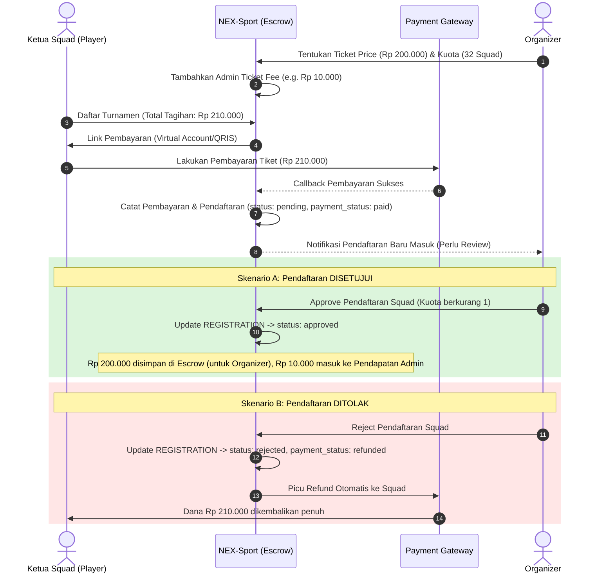

# Skema Penjualan Tiket Pendaftaran Turnamen (Registration Tickets)

Untuk mengakomodasi pendaftaran berbayar (penjualan tiket pendaftaran squad), Organizer dapat mengelola tiket di setiap event turnamen per game, mulai dari harga tiket, kuota (maksimal peserta), dan detail lainnya. Platform/Admin juga akan mengenakan biaya layanan (*service fee*) untuk setiap tiket yang terjual.

Berikut adalah rancangan alur bisnis, penetapan harga, dan penyesuaian basis data untuk sistem tiket pendaftaran:

---

## 🔄 Alur & Struktur Biaya Tiket

Setiap tiket pendaftaran berbayar memiliki komponen harga sebagai berikut:
1. **`ticket_price`:** Harga dasar pendaftaran yang ditentukan oleh Organizer (uang masuk ke Organizer).
2. **`admin_ticket_fee`:** Biaya layanan platform/admin per pendaftaran tiket (uang masuk ke Admin).
3. **`amount_paid` (Total Biaya):** Total uang yang dibayar oleh Squad (`ticket_price` + `admin_ticket_fee`).



---

## 🛠️ Usulan Perubahan Struktur Database

Untuk mendukung skema di atas, kita perlu memodifikasi dua tabel di [implementation_plan.md](file:///d:/webapp/nex-sport/implementation_plan.md):

### A. Tabel `EVENT_GAMES`
Organizer mengonfigurasi properti tiket pendaftaran (harga, kuota, biaya admin) per game pada event tersebut.
```diff
 EVENT_GAMES {
     int id PK
     int games_id FK
     int event_id FK
+    int ticket_price "Harga tiket dasar pendaftaran (0 = gratis)"
+    int max_participants "Kuota / batas maksimal squad peserta game ini"
+    int admin_ticket_fee "Biaya admin per penjualan tiket turnamen ini"
     datetime created_at
 }
```

> [!NOTE]
> Kolom `max_participants` dipindahkan dari tabel `EVENT` ke tabel `EVENT_GAMES` agar setiap jenis game/cabang olahraga dalam satu event dapat memiliki kuota peserta dan harga tiket yang berbeda-beda.

### B. Tabel `REGISTRATION`
Menyimpan rincian harga saat transaksi dilakukan untuk kepentingan *audit trail*.
```diff
 REGISTRATION {
     int id PK
     int squad_id FK
     int event_games_id FK
     enum status "pending | approved | rejected" "Status persetujuan organizer"
     enum payment_status "free | unpaid | paid | refunded"
+    int ticket_price "Harga tiket dasar yang berlaku saat transaksi"
+    int admin_fee "Biaya layanan admin yang berlaku saat transaksi"
     int amount_paid "Total nominal yang dibayarkan (ticket_price + admin_fee)"
     string payment_method "Nullable"
     string payment_receipt "Nullable" "ID Transaksi / Bukti Bayar pendaftaran"
     datetime paid_at "Nullable"
     datetime refunded_at "Nullable" "Waktu refund dilakukan jika ditolak"
     string refund_receipt "Nullable"
     datetime registered_at
     datetime created_at
 }
```

---

## 💼 Pembagian Keuntungan Tiket (Mekanisme Penyelesaian)

* **Penampungan Sementara (Escrow):** Semua dana pembayaran pendaftaran (harga tiket + biaya admin) masuk ke escrow platform.
* **Pelepasan Dana (Disbursement):** Ketika turnamen selesai dan Organizer menekan tombol **"Selesaikan Event"**, sistem secara otomatis menghitung total pendapatan tiket dari seluruh squad yang statusnya `approved` (`SUM(ticket_price)`), lalu mentransfer dana tersebut ke rekening bank Organizer. Biaya layanan (`admin_fee`) dilepas secara otomatis ke rekening profit platform.
